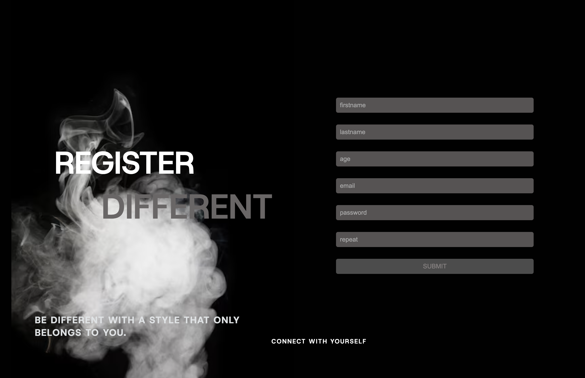

# 📝 Minimalist Registration Form

## 📌 description 
This is a minimalist registration form built using React and Vite.  
The form ensures a clean, modern look with a dark theme, featuring smooth usability and validation for each input field before submission.

## 🖼️ Preview

## 🚀 Technologies Used

 ⚛️ React : Fast and efficient UI rendering  
 ⚡Vite: Optimized build and development  
 🎨 CSS
 
💾​ This project is deployed using *Vercel* for seamless hosting and accessibility.

## 🎯 Features

✨ Elegant and Minimalist UI ✨  
✅ Field validation before submission   
🖤 Dark theme with modern aesthetics   
💡 Smooth user experience 

## 🔧 Future Improvements

📱 Enhance responsiveness  
🎭 Improve animations for a smoother user experience  
🔗 Integrate a backend for real user authentication

## 👩🏽‍💻​ Register Now 
 Register with style and connect with yourself : [REGISTER]( https://littlefoxy1nk.github.io/REACT_FORM/)

